  

  
  
  
  
  
  

<h3 align="center">⚡ What I'm about</h3>

<table align="center" width="100%">
  <tr>
    <td valign="top" width="56%">
      <ul>
        <li>🧬 <b>I build trust-minimized systems:</b> rotating savings circles, crowdfunding escrows and anonymous polls that work without a middleman.</li>
        <li>⛓️ <b>Stellar / Soroban</b> smart contracts in Rust, wired to TypeScript dApps that talk to them end to end.</li>
        <li>🕶️ <b>Zero-knowledge</b> on Midnight: public tally, private voter, one ballot per key, eligibility proven in ZK.</li>
        <li>🔐 <b>Down to the metal:</b> a Ledger hardware-wallet app written in C, because the last mile matters.</li>
        <li>🤖 <b>Now:</b> putting AI agents inside on-chain flows. Web3 × AI is home.</li>
        <li>🥋 RiseIn Stellar journey: White → Yellow → Orange belt.</li>
      </ul>
    </td>
    <td valign="top" align="center">
      
      
    </td>
  </tr>
</table>

<h3 align="center">🛠️ Stack</h3>

  

<h3 align="center">🚀 Featured builds</h3>

<table align="center">
  <tr>
    <td>
      
    </td>
    <td>
      
    </td>
  </tr>
  <tr>
    <td>
      
    </td>
    <td>
      
    </td>
  </tr>
  <tr>
    <td>
      
    </td>
    <td>
      
    </td>
  </tr>
</table>

<h3 align="center">📈 Momentum</h3>

  
  

  

<picture>
  <source media="(prefers-color-scheme: dark)" srcset="https://raw.githubusercontent.com/itsGrizAi/itsGrizAi/output/github-snake.svg"/>
  <source media="(prefers-color-scheme: light)" srcset="https://raw.githubusercontent.com/itsGrizAi/itsGrizAi/output/github-snake-light.svg"/>
  
</picture>

